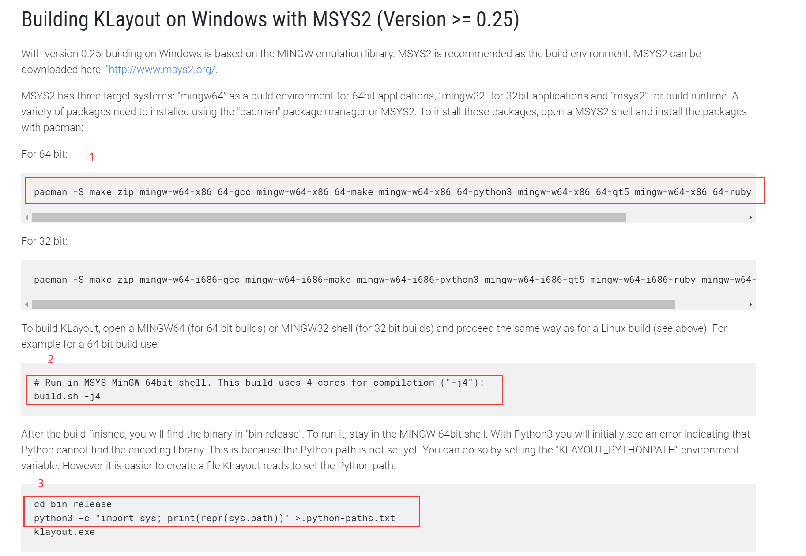
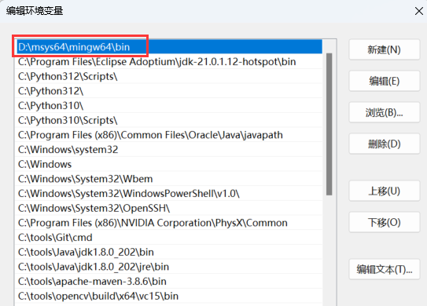

# 构建 klayout

1. 下载klayout hack之后的源码: https://github.com/duhbbx/klayout-hack.git
2. 安装 msys2
3. 打开 msys2 mingw 64 的shell
4. 进入到下载的klayout hack源码的目录
5. 更新pacman的清华镜像
6. 安装必要的组件
    ```bash
    pacman -S make zip mingw-w64-x86_64-gcc mingw-w64-x86_64-make \
          mingw-w64-x86_64-python3 mingw-w64-x86_64-qt5       \
          mingw-w64-x86_64-ruby mingw-w64-x86_64-libgit2
    ```
7. 执行构建
    ```
    # Run in MSYS MinGW 64bit shell. This build uses 4 cores for compilation ("-j4"):
    build.sh -j4
    ```
8. 构建后的任务
    ```bash
    cd bin-release
    python3 -c "import sys; print(repr(sys.path))" >.python-paths.txt
    ```




# 添加到环境变量




mingw 64 的bin目录和klayout 构建后的 bin-release目录都加入到环境变量

构建全部结束，可以使用 c# 的代码调用了

参考下面的代码


# c# 使用的demo


```cs
using System;
using System.Runtime.InteropServices;


class Program
{


    // 定义 HANDLE 类型
    public IntPtr handle;

    // 加载 DLL
    // 请替换为你的 DLL 路径
    const string dllPath = "D:\\msys64\\home\\duhbb\\klayout\\bin-release\\klayout_exportapi.dll"; 

    [DllImport(dllPath, CallingConvention = CallingConvention.Cdecl)]
    public static extern int CreateHandle(out IntPtr handle, bool debug);

    [DllImport(dllPath, CallingConvention = CallingConvention.Cdecl)]
    public static extern int loadFile(IntPtr handle, string file);

    [DllImport(dllPath, CallingConvention = CallingConvention.Cdecl)]
    public static extern int getBox(IntPtr handle, out ApiBox outApiBox);

    [DllImport(dllPath, CallingConvention = CallingConvention.Cdecl)]
    public static extern int exportToImage(IntPtr handle, IntPtr option);

    [DllImport(dllPath, CallingConvention = CallingConvention.Cdecl)]
    public static extern int ReleaseHandle(IntPtr handle);

    // ApiBox 结构体
    [StructLayout(LayoutKind.Sequential)]
    public struct ApiBox
    {
        public double x1;
        public double y1;
        public double x2;
        public double y2;
    }

    // ImageExportOption 结构体
    [StructLayout(LayoutKind.Sequential, CharSet = CharSet.Ansi)]
    public struct ImageExportOption
    {
        public string exportFilePath;
        public string exportImageType;
        public double x1;
        public double y1;
        public double x2;
        public double y2;
        public double width;
        public double height;
        public int linewidth;
        public int oversampling;
        public double resolution;
    }

    // ApiReturnCode 枚举
    public enum ApiReturnCode
    {
        SUCCESS = 0,
        INIT_HANDLE_IS_NOT_NULLPTR = 1,
        HANDLE_INSTANCE_IS_NULLPTR = 2,
        EXCEPTION_1 = 3,
        EXCEPTION_2 = 4,
        EXCEPTION_3 = 5,
        EXCEPTION_4 = 6,
    }


    static void Main(string[] args)
    {
        string directory = @"C:\Users\duhbb\Downloads\";
        string fileName = DateTime.Now.ToString("yyyy-MM-dd_HH-mm-ss") + ".bmp";
        string fullPath = Path.Combine(directory, fileName);
        Console.WriteLine("Export path: " + fullPath);
        string importFile = "C:\\Users\\duhbb\\Downloads\\20240529151519.gds";

        IntPtr handle;

        // 创建句柄
        int result = CreateHandle(out handle, true);
        if (result != (int)ApiReturnCode.SUCCESS)
        {
            Console.WriteLine("Failed to create handle. Error code: " + result);
            return;
        }

        // 加载文件
        result = loadFile(handle, importFile);
        if (result != (int)ApiReturnCode.SUCCESS)
        {
            Console.WriteLine("Failed to load file. Error code: " + result);
            ReleaseHandle(handle);
            return;
        }

        // 获取 Box
        ApiBox apiBox;
        result = getBox(handle, out apiBox);
        if (result != (int)ApiReturnCode.SUCCESS)
        {
            Console.WriteLine("Failed to get box. Error code: " + result);
            ReleaseHandle(handle);
            return;
        }

        Console.WriteLine("Box: " + apiBox.x1 + ", " + apiBox.y1 + ", " + apiBox.x2 + ", " + apiBox.y2);

        // 导出图片
        ImageExportOption option = new ImageExportOption
        {
            exportFilePath = fullPath,
            exportImageType = "bmp",
            x1 = (int)apiBox.x1,
            y1 = (int)apiBox.y1,
            //x2 = (int)apiBox.x2,
            //y2 = (int)apiBox.y2,

            x2 = 0,
            y2 = 0,
            //x1 = -800,
            //y1 = 3000,
            //x2 = 800,
            //y2 = -3000,
            width = 10000,
            height = 10000,
            linewidth = 1,
            oversampling = 2,
            resolution = 0,
        };

        // 注意：需要将结构体指针传递给函数
        IntPtr optionPtr = Marshal.AllocHGlobal(Marshal.SizeOf(option));
        Marshal.StructureToPtr(option, optionPtr, false);

        result = exportToImage(handle, optionPtr);
        Marshal.FreeHGlobal(optionPtr);

        if (result != (int)ApiReturnCode.SUCCESS)
        {
            Console.WriteLine("Failed to export image. Error code: " + result);
            ReleaseHandle(handle);
            return;
        }

        // 释放句柄
        result = ReleaseHandle(handle);
        if (result != (int)ApiReturnCode.SUCCESS)
        {
            Console.WriteLine("Failed to release handle. Error code: " + result);
            return;
        }

        Console.WriteLine("Operations completed successfully.");
    }
}


```
